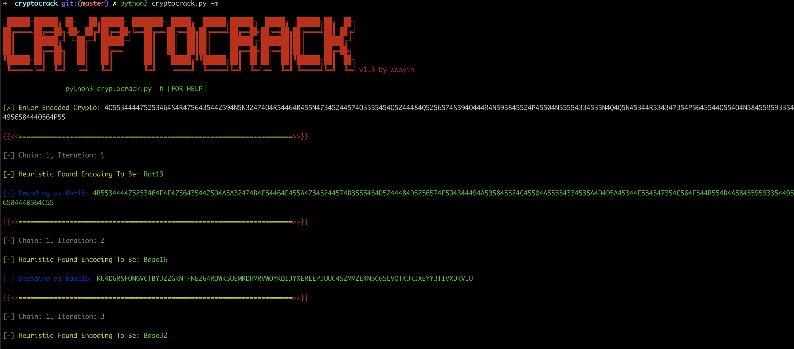
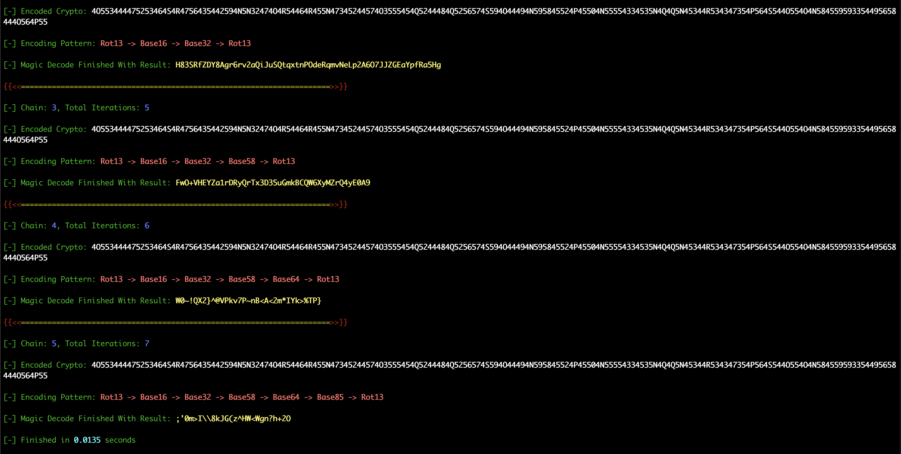
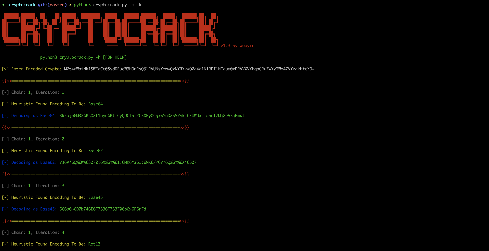
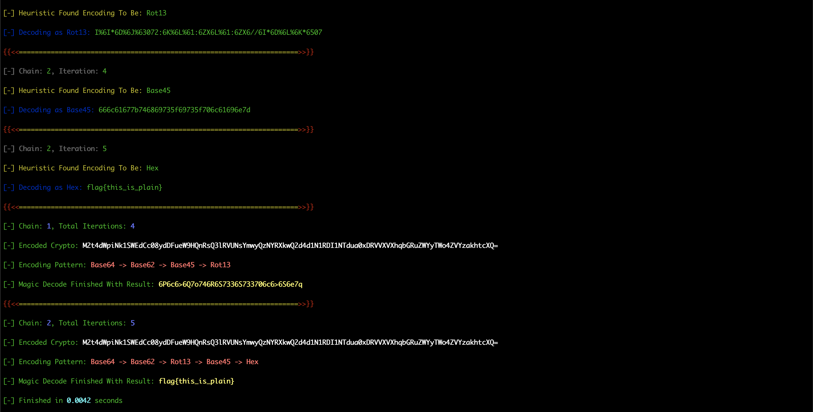

# 0x00 cryptocrack

**cryptocrack** 是一个用Python编写的密码自动破解框架，在[basecrack](https://github.com/mufeedvh/basecrack)的基础上进行功能完善，期望解决CTF中Crypto部分题型

项目地址：[https://github.com/wooyin/cryptocrack](https://github.com/wooyin/cryptocrack)

# 0x01 Features
- Python3+ (tested with Python 3.8.8)
- 支持Linux/OSX/Windows平台运行
- 支持关键Key判断停止解码
- 支持解码链路迭代
- 支持Base家族/Rot13/Morse/hex/buddha/xxencode等多种算法（待完善）

# 0x02 Installation
```
$ git clone https://github.com/wooyin/cryptocrack
$ cd cryptocrack
$ pip3 install -r requirements.txt

$ python3 cryptocrack.py -h


 ██████╗██████╗ ██╗   ██╗██████╗ ████████╗ █████╗  ██████╗██████╗  █████╗  ██████╗██╗  ██╗
██╔════╝██╔══██╗╚██╗ ██╔╝██╔══██╗╚══██╔══╝██╔══██╗██╔════╝██╔══██╗██╔══██╗██╔════╝██║ ██╔╝
██║     ██████╔╝ ╚═██╔═╝ ██████═╝   ██║   ██║  ██║██║     ██████╔╝███████║██║     █████╔╝
██║     ██╔══██╗   ██║   ██╔══╝     ██║   ██║  ██║██║     ██╔══██╗██╔══██║██║     ██╔═██╗
╚██████╗██║  ██║   ██║   ██║        ██║   ╚█████╔╝╚██████╗██║  ██║██║  ██║╚██████╗██║  ██╗
 ╚═════╝╚═╝  ╚═╝   ╚═╝   ╚═╝        ╚═╝    ╚════╝  ╚═════╝╚═╝  ╚═╝╚═╝  ╚═╝ ╚═════╝╚═╝  ╚═╝ v1.3 by wooyin

		python3 cryptocrack.py -h [FOR HELP]

usage: cryptocrack.py [-h] [-b BASE] [-f FILE] [-m] [-o OUTPUT] [-k [KEY]] [-d DEPTH] [-r REPLACE] [-s SLIENT]

optional arguments:
  -h, --help            show this help message and exit
  -b BASE, --base BASE  Decode a single encoded crypto from argument.
  -f FILE, --file FILE  Decode multiple encoded crypto s from a file.
  -m, --magic           Decode multi-encoded crypto s in one shot.
  -o OUTPUT, --output OUTPUT
                        Generate a wordlist/output with the decoded bases, enter filename as the value.
  -k [KEY], --key [KEY]
                        Key to stop iteration.
  -d DEPTH, --depth DEPTH
                        Iteration depth.
  -r REPLACE, --replace REPLACE
                        Auto replace special char.
  -s SLIENT, --slient SLIENT
                        Only display result.
```

# 0x03 Usage

## Magic模式
```
$ python3 cryptocrack.py -m
```




## Key模式
```
$ python3 cryptocrack.py -m -k
or
$ python3 cryptocrack.py -m -k flag
```





# 0x04 TODO
- 支持复杂密钥的算法，如RSA、AES等
- 支持简单密钥的算法，如Caesar Cipher、Vigenere Cipher等
- 完善多个代替算法的利用逻辑，遇到Rot13-Rot47-Rot13-Rot47会进入死循环
- 支持CTF解题模式，针对常规解码算法的返回值，套用常用CTF套路进行文本替换后再继续解密
- 支持静默模式，只打印最终解密结果，不打印解密过程
- 支持设置迭代深度

# 0x05 Q&A
- Q：设计初衷是什么？

  A：厌倦了一个算法开一个解密网站，只希望复制粘贴就能得到答案

- Q：为什么选择Python而不是Java？
  
  A：一开始是想写Java GUI，但考虑到算法兼容性和延伸性，最终还是选择Python

- Q：为什么不叫Basecrack？
  
  A：支持算法在Base家族上进行延伸，期望解决大部分Crypto题型

# 0x06 Problem
- 遇到不支持的算法可以提交[Issues](https://github.com/wooyin/cryptocrack/issues)，共同完善解密算法库
- 如在使用过程中发现Bug或有好的建议，欢迎提交[Issues](https://github.com/wooyin/cryptocrack/issues)

# 0x07 License

cryptocrack is licensed under the MIT License. See [LICENSE](LICENSE) for the full license text.
